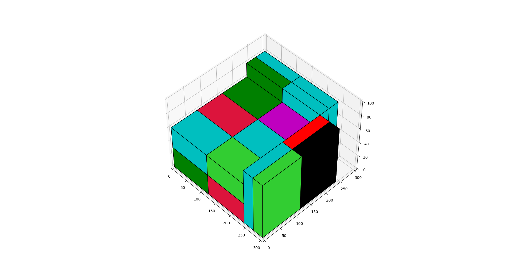
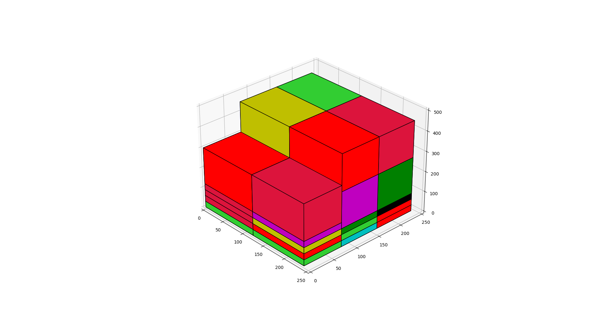

BB Container Problem
====

3D Bin Packing implementasyonu bu makale baz alınarak geliştirilmiştir. [Makale](makale.pdf). Referans kod: [gedex](https://github.com/gedex/bp3d).

## Açıklama

Bin ve item parametrelerinin tanımlanması:
```py
my_bin = Bin(name, width, height, depth, max_weight)
my_item = Item(name, width, height, depth, weight)
```
Packer 3 temel fonksiyona sahip:
```py
packer = Packer()           # PACKER DEFINITION

packer.add_bin(my_bin)      # ADDING BINS TO PACKER
packer.add_item(my_item)    # ADDING ITEMS TO PACKER

packer.pack()               # PACKING - by default (bigger_first=False, distribute_items=False, number_of_decimals=3)
```

Packing işlemi sonrasında:
```py
packer.bins                 # GET ALL BINS OF PACKER
my_bin.items                # GET ALL FITTED ITEMS IN EACH BIN
my_bin.unfitted_items       # GET ALL UNFITTED ITEMS IN EACH BIN
```


## Kullanım

Packer oluşturulup istenilen sayıda bin ve istenilen binlere gerekli itemlar eklenebilir. .pack() fonksiyonu verilen bilgiler doğrusunda packing işlemini geçekleştirecektir.

```py
from py3dbp import Packer, Bin, Item

packer = Packer()

packer.add_bin(Bin('small-envelope', 11.5, 6.125, 0.25, 10))
packer.add_bin(Bin('large-envelope', 15.0, 12.0, 0.75, 15))
packer.add_bin(Bin('small-box', 8.625, 5.375, 1.625, 70.0))
packer.add_bin(Bin('medium-box', 11.0, 8.5, 5.5, 70.0))
packer.add_bin(Bin('medium-2-box', 13.625, 11.875, 3.375, 70.0))
packer.add_bin(Bin('large-box', 12.0, 12.0, 5.5, 70.0))
packer.add_bin(Bin('large-2-box', 23.6875, 11.75, 3.0, 70.0))

packer.add_item(Item('50g [powder 1]', 3.9370, 1.9685, 1.9685, 1))
packer.add_item(Item('50g [powder 2]', 3.9370, 1.9685, 1.9685, 2))
packer.add_item(Item('50g [powder 3]', 3.9370, 1.9685, 1.9685, 3))
packer.add_item(Item('250g [powder 4]', 7.8740, 3.9370, 1.9685, 4))
packer.add_item(Item('250g [powder 5]', 7.8740, 3.9370, 1.9685, 5))
packer.add_item(Item('250g [powder 6]', 7.8740, 3.9370, 1.9685, 6))
packer.add_item(Item('250g [powder 7]', 7.8740, 3.9370, 1.9685, 7))
packer.add_item(Item('250g [powder 8]', 7.8740, 3.9370, 1.9685, 8))
packer.add_item(Item('250g [powder 9]', 7.8740, 3.9370, 1.9685, 9))

packer.pack()

for b in packer.bins:
    print(":::::::::::", b.string())

    print("FITTED ITEMS:")
    for item in b.items:
        print("====> ", item.string())

    print("UNFITTED ITEMS:")
    for item in b.unfitted_items:
        print("====> ", item.string())

    print("***************************************************")
    print("***************************************************")

```
## GÖRSELLEŞTİRME
visualize.py dosyası kullanılarak 3 boyutlu görselleştirilmiş sonuçlara doğrudan ulaşılabilir.

### Örnek görselleştirmeler




## TEST DENEMELERİ
Denenen test case senaryolarının sonuçlarına ve görselleştirmelerine aşağıda linkteki Python Repository sekmesinden ulaşabilirsiniz.
> https://docs.google.com/spreadsheets/d/1GicB3rwzPJe_Hlm_xAzUpQnWtp2qObtKjfGarEcGwDI/edit?usp=sharing

## REFERANSLAR

* https://github.com/bom-d-van/binpacking
* https://github.com/gedex/bp3d
* [MAKALE: Optimizing three-dimensional bin packing through simulation](makale.pdf)
